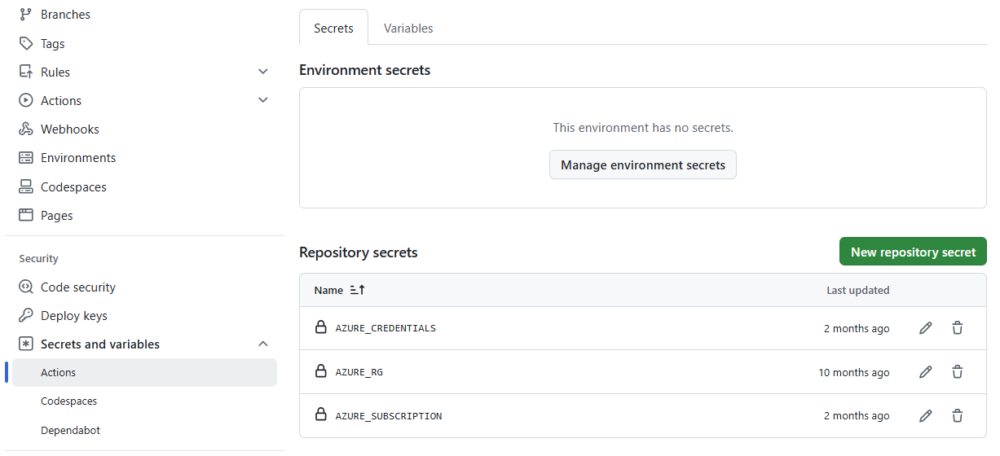

# Building Databricks inside a Private Network with AVM Bicep 

This repository contains a pattern of bicep modules from the https://aka.ms/avm (or go directly to https://github.com/Azure/bicep-registry-modules/tree/main/avm/res/databricks/workspace)

The basic deployment of Databricks with its virtual networks
- Databricks workspace   
- Virtual Network with subnets 
- Network Security Group
- Private Endpoints
- Private DNS Zone for Databricks

The Virtual Machine
- Creates a Microsoft windows server 2022 Data centre
- Bastion host linked to the Virtual network which is created in the above steps
- Public IP for the Bastion

Steps 

# Deployment

## KeyVault for VM password

I have designed this deployment to use KeyVault to store the VM password, that way you can control what that password is. This is how you can do it yourself. 
### 1. Create a keyvault
- Create keyvault in Azure, give it any name you want. I have a Key Vault that is stand alone for these purposes, to store secrets for deployments. 
- Store a password for your VM in a secret named "kv-vmpassword".
- Give your Service principal that you will set up in step 3 at least Key Vault Secret User role.
- Save your Key Vault **name** in the GitHub Actions Secret and Variables/Actions/Variables area. (See below where to save it)

### 2. Clone or Fork this repository
Go to GitHub actions once you forked/cloned. Then add these secrets as you can see in the screenshot

### 3. Create credentials

To create the secret called AZURE_CREDENTIALS you need to make a service principal, like this 

`az ad sp create-for-rbac --name "myApp" --role contributor --scopes /subscriptions/<subscription-id>/resourceGroups/<group-name>/providers/Microsoft.Web/sites/<app-name> --json-auth`

You can find out more on this page https://learn.microsoft.com/en-us/azure/app-service/deploy-github-actions?tabs=userlevel%2Caspnetcore

Give your new Service Principal Contributor and User Access Adminstrator rights in RBAC on your subscription. 

Now store your credentials in GitHub actions

### 4. Run the deployment 
The first time that you run this deployment, you must be set the network to **"new"** for the vnetAddressPrefixParam paramter. This will deploy a new virtual network. Every other subsequent deployment must have this parameter set to **"existing"**

Once you have logged into the VM, navigate go to https://accounts.azuredatabricks.net

(You will be able to log in if you have owner on the Resource Group that databricks was deployed into)

You must now add yourself and others to the Workspace/xxxx/Permissions tab as either a databricks user or admin

Once done, you can open the Azure databricks workspace, the link can be found in the Workspaces tab of the Accounts website that you are logged into

#TODO
#### access and permissions
##### Private endpoints and DNS zones
